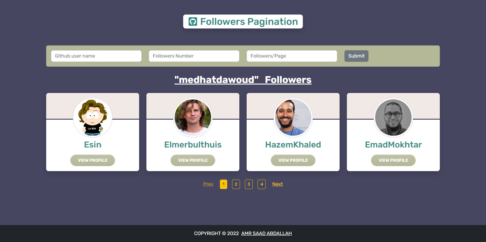
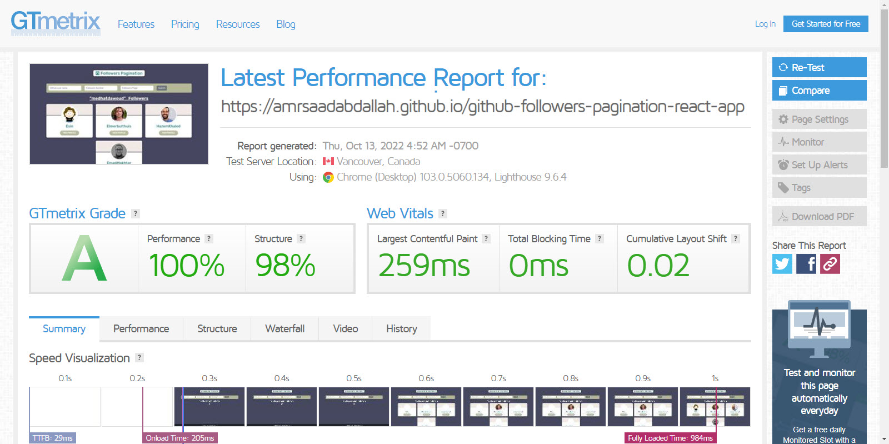

<h1 align="center" >Github Followers Pagination &mdash; React App  </h1>

### 👁️ Project Preview:

- [ Live Preview 👉 https://amrsaadabdallah.github.io/github-followers-pagination-react-app](https://amrsaadabdallah.github.io/github-followers-pagination-react-app)

- [ Github Repo 👉 https://github.com/amrsaadabdallah/my-github-followers-pagination-react-app](https://github.com/amrsaadabdallah/my-github-followers-pagination-react-app)
    - 🚩 It's a private repo <a target="_blank" href="mailto:amrsaadabdallah@gmail.com">contact me </a>to see.

---

### 📝 Project Description & features:

- It's a medium react app (Github Followers Pagination) used to practice react features.
- When page load it's fetch gihub followers default info (user: medhatdawoud,   followrs: 16,
    followrsPerPage: 4)

- I use [Github Followers API](https://docs.github.com/en/rest/users/followers#about-the-followers-api) to fetch github followers for any user it allows to fetch  100 followers or less @ once.

- I handle preview followers by implementing Frontend pagination after fetching them depend on entered followrs: default(16) and
    followrsPerPage: default(4).

- It's allowed to get folloers for any github user you need by entering github userName, numbers of follower you need to show up to 100 and number of followers per page up to 30.

- Pagination has multiple looks if number of pages is less or wqual than 4 will be buttons and otherwise will be a dropdown menu.

---

### 🛠️ Project Tools:

1. Used Google Fonts.

1. Bootstrap Classes for styling.

1. ReactJS Library.

1. [Github Followers API](https://docs.github.com/en/rest/users/followers#about-the-followers-api).

1. PropTypes package for typechecking component props.

1. Random paragraphs list get from local file called data.

1. [GTmetrix](https://gtmetrix.com/) is an online tool for customers to easily test the performance of their webpages.

---

### :sparkles: Project Skills applied:

1. Create Multiple React Component.

1. Configuration react component by props.

1. Render List of items.

1. Apply Conditional Rendering.

1. Deal with form.

1. Fetching Followers from  [Github Followers API](https://docs.github.com/en/rest/users/followers#about-the-followers-api).

1. Use React Hook (UseState, useEffect, useRef).

1. Typechecking component props With PropTypes package.

1. Test the performance of the webpage after deploy by using [GTmetrix](https://gtmetrix.com/).

---

### 🧪 Project performance test:

Test the performance of the webpage after deploy by using [GTmetrix](https://gtmetrix.com/).

---

### 👋 Get In Touch:

- [🌐 Website 👉 https://amrsaadabdallah.github.io](https://amrsaadabdallah.github.io)
- [👔 LinkedIn 👉 https://www.linkedin.com/in/amrsaadabdallah](https://www.linkedin.com/in/amrsaadabdallah)
- [🌟 Github 👉 https://github.com/amrsaadabdallah](https://github.com/amrsaadabdallah)
- [📧 Gmail 👉 amrsaadabdallah@gmail.com](mailto:amrsaadabdallah@gmail.com)
- [🐤 Twitter 👉 https://twitter.com/amrsaadabdallah](https://twitter.com/amrsaadabdallah)
- [:phone: Whatsapp 👉 (+20) 109-775-6067](https://api.whatsapp.com/send/?phone=%2B2001097756067&text&type=phone_number&app_absent=0)

---

<a target="_blank" href="https://amrsaadabdallah.github.io">

 2022 &copy; Amr Saad Abdallah 

</a>

